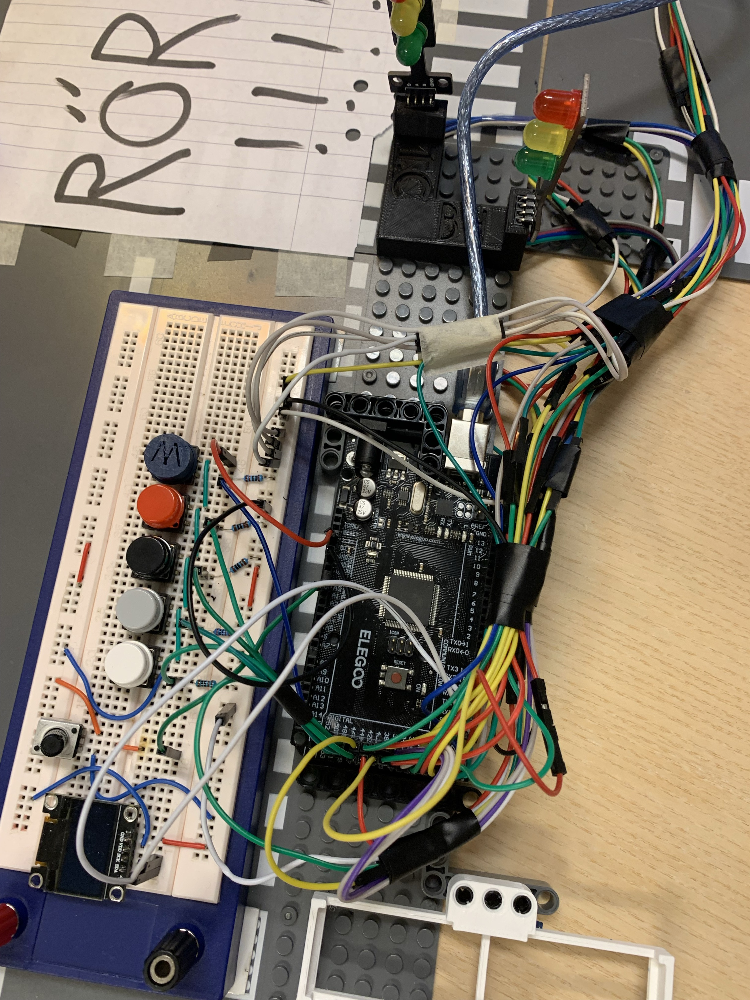

# Arduino Traffic Light Project

## Overview

This project implements a traffic light system using Arduino. It simulates the behavior of traffic lights at an intersection, controlling the flow of traffic through the use of red, yellow, and green lights. Additionally, it allows users to control the traffic lights using buttons to choose the direction and a potentiometer to control the duration of each turn.

## Components Used

- Arduino Mega
- LEDs (Red, Yellow, Green)
- Resistors
- Breadboard
- Jumper wires
- Buttons
- Potentiometer

## Circuit Photo

## Installation and Setup

1. Connect the components according to the provided circuit photo.
2. Upload the Arduino sketch (`traffic_light.ino`) to the Arduino Mega board.
3. Power up the Arduino Mega.

## Usage

Once the setup is complete and the sketch is uploaded, the traffic lights will start functioning automatically. Users can control the traffic lights using the following components:

- Use buttons to choose the direction of traffic flow.
- Adjust the potentiometer to choose which way to turn.

## Customization

- Adjust timing parameters in the Arduino sketch to change the duration of each light state (red, yellow, green).
- Modify the code to implement different traffic light patterns or additional features.

## Troubleshooting

- Double-check connections to ensure they match the circuit diagram.
- Verify that the Arduino sketch was uploaded successfully.
- Ensure that the components (LEDs, resistors) are functioning properly.

## Contributors

- Axel Roxenborg
- Viggo Haimanas Bygdén
- Daniel Lindvall

## License

This project is licensed under the MIT License. See the [LICENSE](LICENSE) file for details.

## Acknowledgements

Special thanks to [Noah Marklund] for providing code help for this project.

For any questions or feedback, please contact [axel.roxenborg@hitachigymnasiet.se] or [viggo.haimanas.bygden@hitachigymnasiet.se] or [daniel.lindvall@hitachigymnasiet.se].
